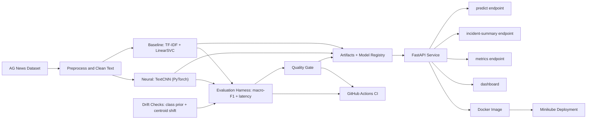

# News Sentinel MLOps

News Sentinel is a production-minded NLP MLOps project for AG News classification.

It demonstrates a full ML delivery loop with measurable gates:
- Classical baseline (`TF-IDF + LinearSVC`)
- Trainable neural model (`TextCNN` in PyTorch)
- Reproducible evaluation + quality gate
- FastAPI inference service + live dashboard
- Prometheus-compatible runtime telemetry
- Drift checks and model registry metadata
- Docker packaging, Minikube manifests and GitHub Actions CI

## Live Demo Workflow

1. Start API (`make run-api`).
2. Open dashboard at `http://localhost:8000/dashboard`.
3. Run `predict` from the UI.
4. Run `incident-summary` (Gemini optional, deterministic fallback supported).
5. Run `make demo-probe` in a second terminal to generate proof artifacts.

Generated demo artifacts:
- `reports/demo_probe.json`
- `reports/demo_probe.md`

## The Problem

Text classification projects often stop at "model training". Hiring teams, however, look for ownership across the full system:
- measurable baselines
- reproducible evaluation
- runtime observability
- deployment shape
- clear rollback/fallback behavior

This project is built to show exactly that end-to-end ownership.

## Architecture



## Why This Stack

- `scikit-learn`: strong, interpretable baseline for ablations.
- `PyTorch`: flexible trainable model path for performance iteration.
- `FastAPI`: typed inference API with test-friendly contracts.
- `prometheus-client`: operational observability from day one.
- `MLflow`: experiment tracking extension point.
- `Docker`: reproducible runtime across machines.
- `Kubernetes/minikube`: realistic deployment shape (probes, config, service).
- `GitHub Actions`: regression gate before merge/deploy.

## Current Status

- Completed: Steps 1-16 (including portfolio-ready demo probe + runbook polish).
- Quality gate currently fails in strict comparison mode because TextCNN underperforms baseline. This is expected and intentionally visible.

## Evaluation Snapshot

Latest reproducible run (`make eval-report`, 2000 AG News test samples):
- Baseline macro-F1: `0.9205`
- TextCNN macro-F1: `0.8311`
- TextCNN p95 latency: `~0.42 ms`
- Gate status: `fail` (TextCNN < baseline, latency passes)

Interpretation:
- Baseline is currently the promotion candidate.
- The gate correctly blocks weaker neural variants.

## Reproducible Local Workflow

```bash
python -m venv venv
source venv/bin/activate
python -m pip install -r requirements.txt
cp .env.example .env

# data + baseline
make prep-data
make train-baseline

# optional neural path
make install-torch
make train-textcnn-quick

# optional Gemini summary dependency
make install-gemini

# evaluation + gate
make eval-report
make quality-gate-soft

# run API + dashboard
make run-api
# open http://localhost:8000/dashboard

# run proof probe while API is up
make demo-probe

# tests
make test
```

## API Surface

- `GET /dashboard` visual control room
- `GET /healthz` service health + available models
- `GET /models` available inference backends
- `POST /predict` classification inference
- `POST /incident-summary` optional Gemini digest with deterministic fallback
- `GET /metrics` Prometheus exposition

Example:

```bash
curl -X POST http://localhost:8000/predict \
  -H "content-type: application/json" \
  -d '{"text":"Stocks rally after earnings beat","model":"auto"}'
```

## Optional Gemini Incident Summary

Enable locally:

```bash
make install-gemini
export GEMINI_SUMMARY_ENABLED=1
export GEMINI_API_KEY="AIza..."   # real key, never commit
export GEMINI_SUMMARY_MODEL="gemini-2.5-flash"
export GEMINI_SUMMARY_FALLBACK_MODELS=""
make run-api
```

Kubernetes mode:
- `k8s/configmap.yaml` defaults `GEMINI_SUMMARY_ENABLED` to `0`.
- `make minikube-secret-from-env` injects `GEMINI_API_KEY` from `.env`.
- Set `GEMINI_SUMMARY_ENABLED=1` to activate.

Behavior notes:
- If Gemini is unavailable or returns poor output, API returns a deterministic, fully structured 4-section summary.

## Observability

Runtime metrics include:
- `news_api_requests_total`
- `news_api_predictions_total`
- `news_api_errors_total`
- `news_api_request_latency_seconds`
- `news_api_prediction_confidence`
- incident-summary counters/latency metrics

Quick check:

```bash
curl -s http://127.0.0.1:8000/metrics | head -n 40
```

## Deployment

### Docker

```bash
make docker-build
make docker-run
```

Torch-enabled image:

```bash
make docker-build-torch
make docker-run-torch
```

### Minikube

```bash
make minikube-build-image
make minikube-secret-from-env
make minikube-deploy
make minikube-status
minikube service -n news-sentinel news-sentinel-api --url
```

## Demo Probe + Recording Checklist

Use this checklist for demo recordings:

1. Start API with Gemini enabled (or intentionally disabled to show fallback path).
2. Open dashboard and run at least one `predict` request.
3. Run at least one `incident-summary` request.
4. In another terminal run `make demo-probe`.
5. Show `reports/demo_probe.md` and `reports/demo_probe.json`.
6. Show `/metrics` and call out core counters.

This creates a reproducible evidence bundle (UI + API + telemetry + report files).

## CI/CD

Workflow: `.github/workflows/ci.yml`

Runs on push/PR:
- compile-based lint
- unit tests
- data prep + baseline train
- evaluation + soft gate check
- Docker CPU build

## Responsible AI + Risk Controls

- Baseline-first decisioning keeps a strong classical fallback in place.
- Optional LLM output is bounded and normalized into strict 4-section structure.
- Runtime fallback avoids hard failure when external LLM is unavailable.
- Quality gate prevents unqualified model promotion.

## Limitations

- TextCNN currently under baseline performance.
- Batch-first design; no live streaming ingestion yet.
- Gemini summary quality is still prompt-dependent and should be benchmarked for production policies.

## Roadmap

- Improve TextCNN training recipe (balancing, schedules, hard examples).
- Add automatic model promotion policy from repeated eval windows.
- Expand drift checks and alerting thresholds.
- Add Grafana dashboard bundle for metrics visualization.

## Topics to Highlight

- Problem framing: move beyond notebook ML into deployable NLP operations.
- Engineering decision: keep baseline as first-class model and enforce gate rules.
- MLOps maturity: observability, reproducibility, deployment manifests, CI checks.
- Production realism: optional LLM value-add with deterministic fallback path.
